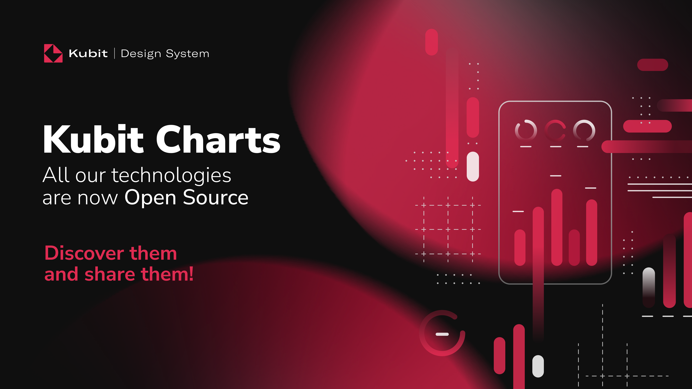
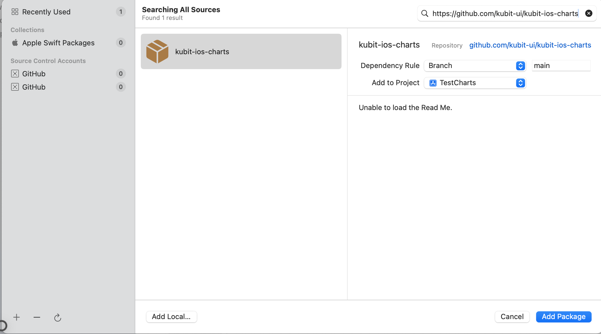
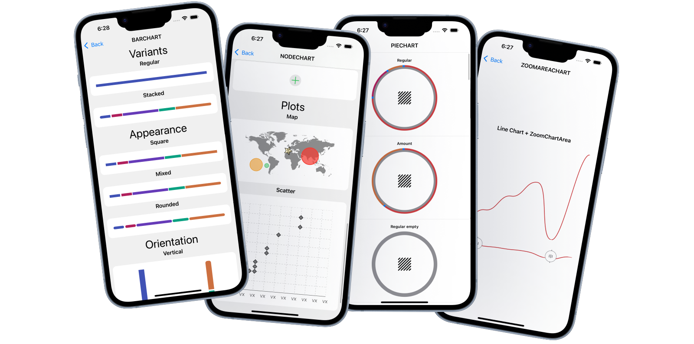

# Kubit Charts iOS

## 📖 Index

* [🎯 Overview](#overview)
* [⚙️ Requirements](#requirements)
* [📦 Installation](#installation)
* [✨  Features](#features)
* [📱 Live Demo](#live-demo)
* [♿ Accessibility First](#accessibility-first)
* [🚀 Usage](#usage)
  * [⚡ Quick Example](#quick-example)
  * [📚 Full Documentation](#full-documentation)
* [👩‍💻👨‍💻 Contributions](#contributions)
* [🔑 License](#license)

## Overview

Kubit Charts is a modern, accessible chart library for iOS applications built with SwifUI. Designed with accessibility as a core principle, it follows WCAG (Web Content Accessibility Guidelines) standards to ensure inclusive design for all users.

> 💡 **Cross-platform**: Kubit Charts is also available for [Web](https://github.com/kubit-ui/kubit-react-charts) and [Android](https://github.com/kubit-ui/kubit-android-charts) platforms, enabling consistent chart experiences across all your applications.

This repository includes the following libraries:

* **KubitCharts**: The main library containing the chart components.

## Requirements

Required software:

    * **Xcode 16 or newer** (16.4 recommended)
    * **iOS 15.0 or newer**
  


## Installation

To install KubitCharts you can use the Swift Packet Manager (SPM).
In Xcode navigate to File → Swift Packages → Add Package Dependency...
Use this URL to add the dependency: `https://github.com/kubit-ui/kubit-ios-charts`



## Features

| Chart Type | Key Features | Status |
|------------|--------------|--------|
| 📈 **Line Chart** | Multiple lines, shadows, animations | ✅ |
| 📊 **Bar Chart** | Horizontal, stacked, grouped | ✅ |
| 🍰 **Pie Chart** | Custom labels, borders, rotation | ✅ |
| 🗺️ **Plot Chart** | Interactive points, custom markers | ✅ |
| 📐 **Axis Chart** | Multiple orientations, styling | ✅ |

| Base Component | Description | Status |
|------------|--------------|--------|
| 🔎 **Zoom Area** | Pinch-to-zoom, pan gestures | ✅ |
| 🔤 **Legend** | Positioning, custom styling | ✅ |
| ⭐ **Node** | Interactive points in charts | ✅ |
| ― **Line** | Lines and connectors | ✅ |
| 📶 **Bar** | Rectangular bars | ✅ |
| 🏞️ **Custom Background** | Customizable backgrounds | ✅ |

## Live Demo

If you want to add the test the demo app to see the implementation examples, follow the next steps:
1. Download or clone this repository.
2. Open the `Demo/KubitChartsDemo.xcodeproj` file.
3. Enjoy it!   



## Accessibility First

Built with inclusivity in mind:

- ✅ **WCAG 2.1 AA Compliant** - Meets accessibility standards
- 🔊 **Screen Reader Support** - Full TalkBack compatibility
- ⌨️ **Keyboard Navigation** - Complete keyboard accessibility
- 🎯 **Focus Management** - Proper focus indicators and tab order
- 🏷️ **Semantic Labels** - Meaningful content descriptions
- 📝 **Alternative Text** - Comprehensive alt text for visual data
- 🎨 **High Contrast** - Adapts to system accessibility settings


## Usage

Import the package in the file you would like to use it: `import KubitCharts`

### Quick Example

Here's a simple LineChart to get you started:

```Swift
import KubitCharts

let lineChart = LineChartView()
lineChart.data = [
    LineChartDataEntry(x: 1.0, y: 5.0),
    LineChartDataEntry(x: 2.0, y: 15.0),
    LineChartDataEntry(x: 3.0, y: 25.0)
]
lineChart.title = "User Trends"
lineChart.configureAppearance(with: .light)
view.addSubview(lineChart)
```

### Full documentation
For comprehensive guides, examples, and detailed API documentation:

👉 **[Complete Documentation](README_EXTENDED_DOC.md)**

## Contributions

We extend our heartfelt gratitude to all the developers and contributors who have made Kubit Charts possible. Your dedication, feedback, and contributions continue to drive innovation and make this library better for the entire community. Thank you for being part of the Kubit ecosystem!

Contributions are welcome. Please follow the steps below to contribute:

1. Fork the repository.
2. Create a new branch for your feature or bugfix.
3. Submit a pull request with a detailed description of the changes.

## License

This project is licensed under the Apache License 2.0 - see the [LICENSE](./LICENSE) file for details.

---

<p align="center">
  Made with ❤️ by the <strong>Kubit</strong> team 
</p>
