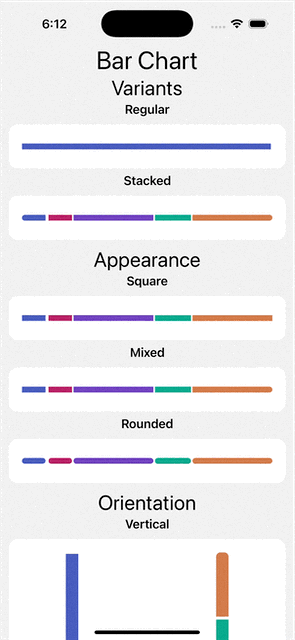
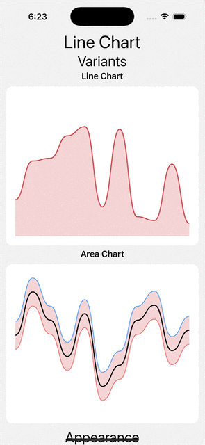
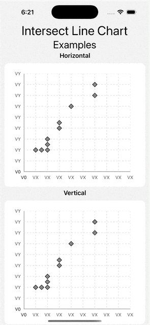
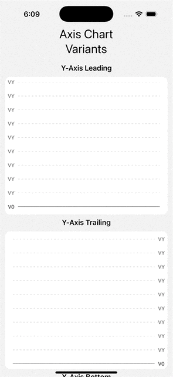
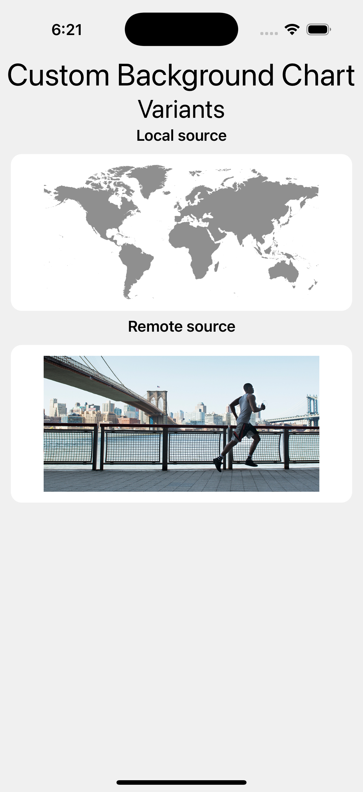
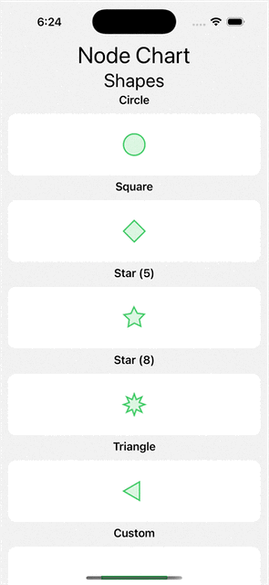
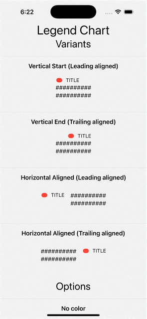
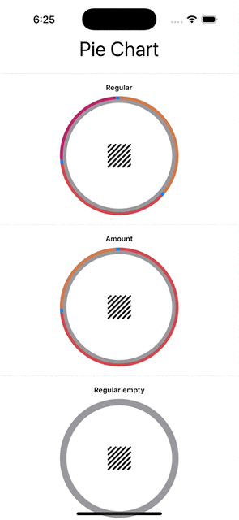
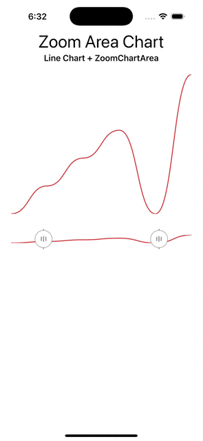

# Kubit Charts iOS

## Index

* [Description](#description)
* [Usage](#usage)
   * [Example: Bar Chart](#example-bar-chart)
   * [Example: Line Chart](#example-line-chart)
   * [Example: Intersect Line Chart](#example-axis-chart)
   * [Example: Axis Chart](#example-axis-chart)
     * [Using custom background](#using-custom-background)
     * [Using nodes](#using-node)
     * [Using legend](#using-legend)
   * [Example: Pie Chart](#example-pie-chart)
   * [Example: Zoom Area Chart](#example-zoom-area-chart)

## Description

Kubit Charts is a library that provides a set of customizable and easy-to-use charts for Android applications. 
It is built using Jetpack Compose and currently supports:

- Axis
- Line chart
- Bar chart
- Plot chart
- Pie chart
- Zoom area chart

This library is an alpha version and it is still under development. More charts and features will be added in future releases.

## Usage

Import the package in the file you would like to use it: `import KubitCharts`

### Example: Bar Chart

The following example illustrates how to initialize and configure a bar chart using the KubitCharts library:

```Swift
import KubitCharts

let barChart = BarChartView()
barChart.data = [
    BarChartDataEntry(x: 1.0, y: 10.0),
    BarChartDataEntry(x: 2.0, y: 20.0),
    BarChartDataEntry(x: 3.0, y: 30.0)
]
barChart.title = "Monthly Sales"
view.addSubview(barChart)
barChart.configureAppearance(with: .default)
```



### Example: Line Chart

The following example illustrates how to initialize and configure a line chart:

```Swift
import KubitCharts

let lineChart = LineChartView()
lineChart.data = [
    LineChartDataEntry(x: 1.0, y: 5.0),
    LineChartDataEntry(x: 2.0, y: 15.0),
    LineChartDataEntry(x: 3.0, y: 25.0)
]
lineChart.title = "User Trends"
lineChart.configureAppearance(with: .light)
view.addSubview(lineChart)
```



### Example: Intersect Line Chart

The following example illustrates how to initialize and configure an intersect line chart:

```Swift
import KubitCharts

let xAxis = SBAxisHelper.defaultAxis(position: .end, label0: "V0", label: "VX")
let yAxis = SBAxisHelper.defaultAxis(position: .start, label0: "V0", label: "VY")
KAxisChart()
.xAxis(xAxis)
.yAxis(yAxis)
.addNodes([
.polygon(
    position: KShape.Position(center: CGPoint(x: 2.0, y: 2.0), xRadius: 0.2),
    numberOfVertices: 4,
    style: KShape.Style(fillColor: Color.black.opacity(0.5), borderColor: Color.black, borderWidth: 1.0),
    accessibility: .decorative(identifier: "Square1")),
.polygon(
    position: KShape.Position(center: CGPoint(x: 1.0, y: 2.0), xRadius: 0.2),
    numberOfVertices: 4,
    style: KShape.Style(fillColor: Color.black.opacity(0.5), borderColor: Color.black, borderWidth: 1.0),
    accessibility: .decorative(identifier: "Square2"))
])
.setHorizontalIntersectLine(color: Color.green)
```



### Example: Axis Chart
The following example illustrates how to initialize and configure an axis chart:

```Swift
import KubitCharts

let xAxis = KAxisBuilder()
    .addPointWithDefaultSolidLine(0, labelStyle: .labeled("0"))
    .addPointWithDefaultSolidLine(100, labelStyle: .labeled("100"))
    .setLabelsViewPosition(.start)
    .build()

let yAxis = KAxisBuilder()
    .addPointWithDefaultSolidLine(0, labelStyle: .labeled("0"))
    .addPointWithDefaultSolidLine(100, labelStyle: .labeled("100"))
    .setLabelsViewPosition(.start)
    .build()

 KAxisChart()
 .xAxis(xAxis)
 .yAxis(yAxis)
 ```
 


#### Using custom background
The following example illustrates how to use a custom background in an axis chart:

```Swift
import KubitCharts

KAxisChart()
    .addBackground(
        KCustomBackground(source: .remote(url: URL(string: "url")),
        accessibility: KCustomBackground.Accessibility(identifier: "RemoteSourceIdentifier")))

 ```

#### Using nodes
The following example illustrates how to use nodes in an axis chart:

```Swift
import KubitCharts

let nodes = ([
    .polygon(
        position: KShape.Position(center: CGPoint(x: 2.0, y: 2.0), xRadius: 0.2),
        numberOfVertices: 4,
        style: KShape.Style(fillColor: Color.black.opacity(0.5), borderColor: Color.black, borderWidth: 1.0),
        accessibility: .decorative(identifier: "Square1")),
    .polygon(
        position: KShape.Position(center: CGPoint(x: 1.0, y: 2.0), xRadius: 0.2),
        numberOfVertices: 4,
        style: KShape.Style(fillColor: Color.black.opacity(0.5), borderColor: Color.black, borderWidth: 1.0),
        accessibility: .decorative(identifier: "Square2"))
])
KAxisChart()
    .xAxis(xAxis)
    .yAxis(yAxis)
    .addNodes(nodes)
 ```
 
#### Using legend
The following example illustrates how to use legends in an axis chart:

```Swift
import KubitCharts

 KLegend(title: "Title", identifier: "KLegend.America.Identifier")
     .value("30%", secondaryValue: "5%")
     .colorView(.black)
     .titleFont(...)
     .titleAlignment(.end)
     .orientation(.vertical)
 ```

| Custom Background | Nodes | Legend |
|-------------------|-------|--------|
|  |  |  |

### Example: Pie Chart

The following example demonstrates how to initialize and configure a zoom area chart:

```Swift
import KubitCharts

let pieChart = PieChartView()
pieChart.data = [
    PieChartDataEntry(value: 40.0, label: "iOS"),
    PieChartDataEntry(value: 30.0, label: "Android"),
    PieChartDataEntry(value: 30.0, label: "Web")
]
pieChart.title = "User Distribution"
pieChart.configureAppearance(with: .dark)
view.addSubview(pieChart)
```



### Example: Zoom Area Chart

The following example demonstrates how to initialize and configure a pie chart:

```Swift
import KubitCharts

var zoomLine: KLine {
let points: [CGPoint] = [
    CGPoint.zero,
    CGPoint(x: 1.0, y: 1)]
let KLine(
    points: points,
    appearance: .rounded,
    style: .solid,
    zoomable: KLine.Zoomable(startHandle: lowerBound, endHandle: upperBound, points: points),
    accessibilityIdentifier: "zoomlineIdentifier")
}

let axisChart = KAxisChart()
.xAxis(xAxis)
.yAxis(yAxis)
.addLines([zoomLine])

let zoomAreaChart = KZoomAreaChart(
startHandle: $startHandle,
endHandle: $endHandle,
content: { axisChart },
opacityColor: Color.blue)
```

